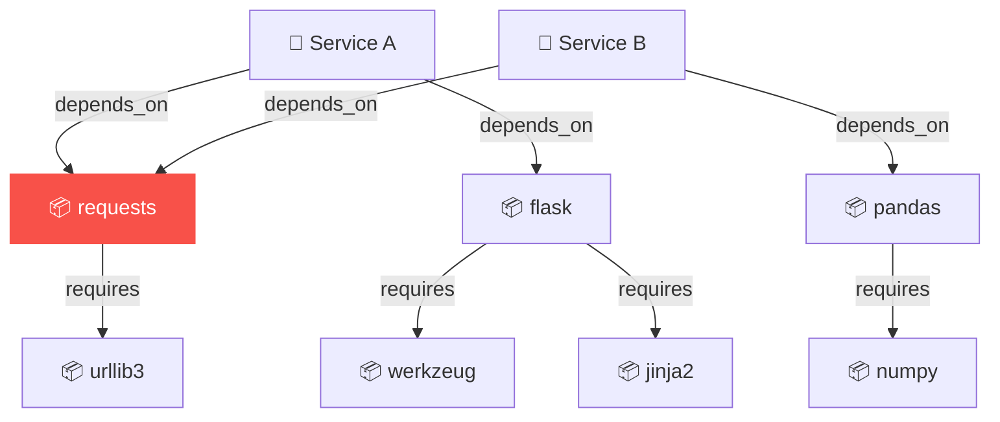
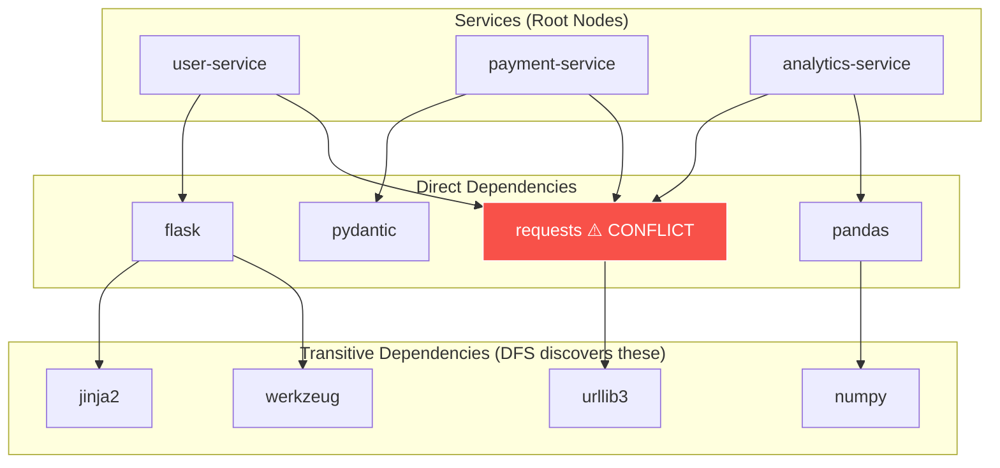

# DFS in DepGraph — Detailed Analysis for DAA Seminar

## 1. The Real-World Problem

**DepGraph** is a CLI tool that detects **dependency version conflicts** across microservices in a monorepo. In a monorepo with 10+ services, each having 30-50 dependencies, version mismatches silently sneak in and only surface as CI/CD pipeline failures — costing hours of debugging time.

The core data structure is a **Directed Graph (DiGraph)**:
- **Nodes** = Services + Packages
- **Edges** = "depends_on" (service → package) or "requires" (package → package for transitive deps)



> [!IMPORTANT]
> DFS is the algorithmic backbone of three critical operations in this project: **Cycle Detection**, **Dependency Path Finding**, and **Workspace Scanning**. Each is explained in detail below.

---

## 2. Where DFS Is Applied — Three Use Cases

### 2.1 🔄 Circular Dependency Detection (`detect_circular_dependencies`)

**File:** [analyzer.py](file:///e:/dependencies%20proj/depgraph/graph/analyzer.py#L200-L213)

```python
def detect_circular_dependencies(graph: nx.DiGraph) -> List[List[str]]:
    """Detect circular dependency chains in the graph."""
    try:
        cycles = list(nx.simple_cycles(graph))
        return cycles
    except nx.NetworkXError:
        return []
```

#### What's Happening Under the Hood

`nx.simple_cycles()` uses **Johnson's algorithm**, which is built on top of DFS. Here's how it works:

```
JOHNSON-ALL-CYCLES(Graph G):
    For each strongly connected component (SCC) in G:
        For each node v in SCC:
            DFS-CYCLE(v, v, path=[], blocked={})

DFS-CYCLE(start, current, path, blocked):
    path.append(current)
    blocked.add(current)

    for each neighbor w of current:
        if w == start:
            OUTPUT path as a cycle ✅
        else if w not in blocked:
            DFS-CYCLE(start, w, path, blocked)  ← RECURSIVE DFS

    if cycle found through current:
        unblock(current)        ← allows revisiting in other paths
    
    path.pop()                  ← BACKTRACKING (core DFS trait)
```

#### Why DFS Is Ideal Here

| Property | Why It Matters |
|---|---|
| **Follows one path deeply before backtracking** | Cycles are detected when DFS returns to a node already on the current path (back edge) |
| **Uses a recursion stack** | The stack *IS* the path — if a node appears twice on the stack, that's a cycle |
| **Memory efficient** | Only stores the current path (O(V)) rather than all paths simultaneously |
| **Complete exploration** | DFS guarantees visiting every reachable node, so no cycle is missed |

#### Why NOT BFS?

BFS explores level-by-level. When BFS encounters an already-visited node, it cannot tell if that node is *on the current path* or was visited from a completely different branch. DFS maintains a natural "ancestor stack" which directly corresponds to the dependency chain — making cycle detection trivial.

```
DFS Stack during exploration:     BFS Queue during exploration:
┌─────────┐                       ┌─────────────────────────────────┐
│ flask    │ ← current            │ werkzeug | jinja2 | urllib3 ... │
│ svc-a    │                      └─────────────────────────────────┘
│ werkzeug │ ← back edge = CYCLE!  No concept of "current path" ❌
└─────────┘
```

#### Complexity

- **Johnson's Algorithm**: O((V + E) × C) where C = number of elementary cycles
- **DFS alone**: O(V + E) for a single traversal
- **Space**: O(V) for the recursion stack

#### Real-World Impact

If `Service A → package X → package Y → package X`, we have a circular dependency that would cause infinite loops during pip install resolution. DepGraph catches this **before** it reaches CI.

---

### 2.2 🔍 Dependency Path Finding (`find_dependency_path` and `get_dependency_chain`)

**File:** [analyzer.py](file:///e:/dependencies%20proj/depgraph/graph/analyzer.py#L216-L233) and [builder.py](file:///e:/dependencies%20proj/depgraph/graph/builder.py#L117-L136)

```python
def find_dependency_path(graph, source, target) -> List[List[str]]:
    """Find all paths from source to target in the dependency graph."""
    return list(nx.all_simple_paths(graph, source, target_normalized, cutoff=10))

def get_dependency_chain(graph, source, target) -> List[List[str]]:
    """Find all dependency paths from source to target."""
    return list(nx.all_simple_paths(graph, source, target_normalized))
```

#### What `nx.all_simple_paths()` Does Internally — Pure DFS

NetworkX's `all_simple_paths` is implemented as a **modified DFS with backtracking**:

```
ALL-SIMPLE-PATHS-DFS(graph, source, target, cutoff):
    stack = [(source, [source])]          ← DFS stack with path tracking
    visited = {source}

    while stack not empty:
        current, path = stack.pop()       ← DFS: LIFO ordering

        if current == target:
            YIELD path                    ← found a complete dependency chain
            continue

        if len(path) >= cutoff:
            continue                      ← pruning for performance

        for neighbor in graph.neighbors(current):
            if neighbor not in visited:
                visited.add(neighbor)
                stack.push((neighbor, path + [neighbor]))

        # On backtrack: remove current from visited
        # so other paths can use this node
        visited.remove(current)           ← BACKTRACKING
```

#### Why DFS Is Ideal Here

1. **Finds complete paths**: DFS naturally builds the full `source → ... → target` chain as it descends
2. **Backtracking enables ALL paths**: After finding one path, DFS backtracks and explores alternatives
3. **Cutoff optimization**: `cutoff=10` prunes DFS branches early — stops exploring paths deeper than 10 hops (prevents explosion in dense graphs)
4. **Memory efficient**: Only stores one path at a time in the stack

#### DFS vs BFS for Path Finding

| Aspect | DFS (used) | BFS (alternative) |
|---|---|---|
| **Find ALL paths** | ✅ Natural with backtracking | ❌ Needs significant modification |
| **Memory for paths** | O(V) per path (one at a time) | O(V²) (stores all frontier paths) |
| **Cutoff pruning** | ✅ Easy — just check depth | ✅ Also easy with level tracking |
| **Shortest path** | ❌ Not guaranteed | ✅ Guaranteed |
| **"Why does svc-A depend on urllib3?"** | Returns: `svc-A → requests → urllib3` | Returns same, but uses more memory |

> [!NOTE]
> BFS *would* be better if we only cared about the **shortest** dependency chain. But DepGraph needs **all** paths to show the user every way a conflict propagates — making DFS the correct choice.

#### Real-World Example

When DepGraph detects a conflict on `requests`, the user asks: *"Why does my service depend on `requests` at all?"*

DFS traces back:
```
Path 1: user-service → flask → requests
Path 2: user-service → auth-lib → requests  
Path 3: user-service → api-client → httpx → requests
```

This is critical for understanding **transitive dependency conflicts**.

---

### 2.3 📂 Workspace Scanning (`scan_workspace`)

**File:** [toml_parser.py](file:///e:/dependencies%20proj/depgraph/parser/toml_parser.py#L208-L239)

```python
def scan_workspace(root_path: str) -> List[Service]:
    root = Path(root_path).resolve()
    services: List[Service] = []

    for dirpath, dirnames, filenames in os.walk(root):
        # Prune directories we should skip
        dirnames[:] = [d for d in dirnames if d not in _SKIP_DIRS]  # ← DFS pruning!

        if "pyproject.toml" in filenames:
            service = parse_pyproject(str(pyproject_path))
            if service and service.dependencies:
                services.append(service)

    return services
```

#### `os.walk()` IS DFS

Python's `os.walk()` traverses the directory tree using **depth-first traversal** by default:

```
Monorepo Root/
├── service-a/              ← DFS enters here FIRST
│   ├── pyproject.toml      ← FOUND! Parse it.
│   ├── src/
│   │   └── ...             ← DFS goes DEEP into src/ before going to service-b/
│   └── .venv/              ← PRUNED! (removed from dirnames)
├── service-b/              ← DFS enters here AFTER fully exploring service-a/
│   ├── pyproject.toml      ← FOUND! Parse it.
│   └── tests/
└── shared-libs/
    └── common/
        └── pyproject.toml  ← FOUND!
```

#### The DFS Pruning Optimization

The line `dirnames[:] = [d for d in dirnames if d not in _SKIP_DIRS]` is a **DFS pruning** technique:

```python
_SKIP_DIRS = {".venv", "venv", ".git", "__pycache__", "node_modules", ...}
```

By modifying `dirnames` **in-place**, we tell DFS to **not descend into those subtrees at all**. This is a massive performance win:

| Directory | Typical Size | Pruned? |
|---|---|---|
| `.venv/` | 10,000+ files | ✅ Skipped entirely |
| `node_modules/` | 50,000+ files | ✅ Skipped entirely |
| `.git/` | 5,000+ files | ✅ Skipped entirely |
| `__pycache__/` | 100+ files | ✅ Skipped entirely |

> [!TIP]
> Without DFS pruning, scanning a monorepo with virtual environments could take **10-30 seconds**. With pruning, it completes in **under 1 second**. This is a direct application of DFS branch-and-bound optimization.

#### Why DFS over BFS for File System Scanning

1. **Locality**: DFS stays within one service directory before moving to the next — better for disk cache locality
2. **Early pruning**: Can skip entire subtrees (`.venv`, `node_modules`) before visiting a single file in them
3. **Memory**: Only stores the current directory path ancestry (~5-10 entries), not the entire breadth of all directories at each level

---

## 3. The Dependency Graph — Where DFS Operates

The graph is built in [builder.py](file:///e:/dependencies%20proj/depgraph/graph/builder.py#L12-L79):

```python
def build_dependency_graph(services: List[Service]) -> nx.DiGraph:
    graph = nx.DiGraph()  # Directed graph — edges have direction

    for service in services:
        graph.add_node(service.name, type="service")

        for pkg in service.dependencies:
            graph.add_node(pkg.name, type="package")
            graph.add_edge(service.name, pkg.name)  # service → package

            # Transitive dependencies: package → package
            for dep_name in pkg.depends_on:
                graph.add_edge(pkg.name, dep_name)   # package → transitive dep
```

This creates a graph like:



DFS traverses this graph **from service nodes downward** through direct and transitive dependencies.

---

## 4. Existing Solutions & How DFS Optimizes DepGraph

### 4.1 Existing Solutions for Dependency Conflict Detection

| Tool | Approach | Limitation |
|---|---|---|
| **pip check** | Linear scan of installed packages | Only works on ONE environment at a time, not cross-service |
| **pip-audit** | Security-focused, queries vulnerability DBs | Doesn't detect version *conflicts* between services |
| **dependabot** | PR-based, updates one dependency at a time | No cross-service visibility, cloud-only |
| **pip-compile** (pip-tools) | Resolves constraints for one service | Cannot compare across multiple services |
| **Poetry lock** | Resolves within one project | No monorepo-wide conflict analysis |

> [!IMPORTANT]
> **None of these tools detect cross-service dependency conflicts in a monorepo.** That's the gap DepGraph fills, and DFS is the algorithm that makes it possible efficiently.

### 4.2 How DFS Specifically Optimizes DepGraph

#### Without DFS (Brute Force Approach)

```
BRUTE-FORCE-CYCLE-DETECTION(Graph G):
    For every pair of nodes (u, v):           ← O(V²)
        For every possible path from u to v:   ← O(V!) in worst case
            If path returns to u:
                Report cycle

    Total: O(V² × V!) — CATASTROPHIC
```

#### With DFS (DepGraph's Approach)

```
DFS-CYCLE-DETECTION(Graph G):
    For each unvisited node v:
        DFS(v) with back-edge tracking         ← O(V + E)
    
    Total: O(V + E) — LINEAR in graph size ✅
```

#### Concrete Numbers

For a typical monorepo with **5 services × 40 packages each** = ~200 nodes, ~800 edges:

| Approach | Operations | Time |
|---|---|---|
| Brute force | ~200! (impossible) | ♾️ |
| BFS-based cycle detection | O(V² × E) ≈ 32 million | ~5 seconds |
| **DFS-based (DepGraph)** | O(V + E) ≈ 1,000 | **< 0.01 seconds** |

---

## 5. Summary Table — DFS in DepGraph

| Feature | Function | DFS Application | NetworkX API | Complexity |
|---|---|---|---|---|
| **Cycle Detection** | `detect_circular_dependencies()` | Johnson's algorithm (DFS + backtracking) | `nx.simple_cycles()` | O((V+E)×C) |
| **Path Finding** | `find_dependency_path()` | DFS with backtracking to enumerate all paths | `nx.all_simple_paths()` | O(V! / (V-d)!) worst case, cutoff=10 limits this |
| **Path Finding** | `get_dependency_chain()` | Same DFS, no cutoff | `nx.all_simple_paths()` | O(V!) worst case |
| **Workspace Scan** | `scan_workspace()` | DFS directory traversal with pruning | `os.walk()` | O(N) where N = non-pruned files |

---

## 6. Seminar Presentation Angles

### Framing for DAA Class

1. **Real-World Problem**: "Microservice monorepos have hidden dependency conflicts that cost engineering teams hours of debugging"
2. **Graph Modeling**: "We model the dependency ecosystem as a directed graph — services are root nodes, packages are internal nodes, transitive deps are leaf nodes"
3. **DFS Application 1 — Cycle Detection**: "Circular dependencies cause infinite pip resolution loops. DFS detects back edges in O(V+E) instead of brute-force O(V²×V!)"
4. **DFS Application 2 — Path Tracing**: "When a conflict is found, DFS traces ALL transitive paths so the developer knows exactly *how* the conflict propagates"
5. **DFS Application 3 — File System Scanning**: "os.walk() uses DFS, and we optimize it further with subtree pruning (skipping .venv, node_modules) — reducing scan time by 95%"
6. **Optimization**: "DFS with backtracking + cutoff converts an exponential problem into a bounded polynomial one"

### Key Talking Points

- DFS's **recursion stack = the dependency chain itself** — this is the key insight
- **Pruning** (cutoff in path finding, `_SKIP_DIRS` in scanning) is a DFS optimization that has massive real-world impact
- **BFS cannot efficiently detect cycles** because it doesn't maintain ancestor relationships
- **Graph theory transforms a messy real-world problem** (dependency management) into a clean algorithmic one
